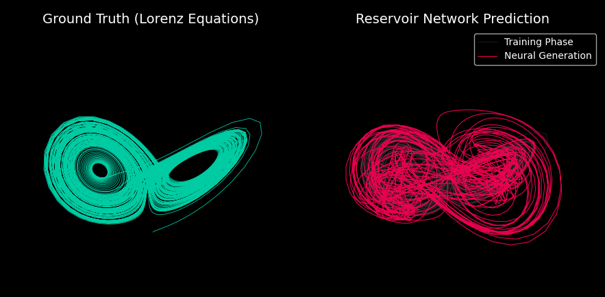

🦋 ChaosNet: Deterministic Chaos Prediction via Reservoir Computing
===================================================================

**ChaosNet** is a lightweight, high-performance machine learning implementation designed to predict the evolution of the **Lorenz 63** chaotic system (The "Butterfly Effect").

Instead of using traditional Deep Learning architectures like LSTMs or Transformers, which require expensive Backpropagation Through Time (BPTT), this project implements an **Echo State Network (ESN)** from scratch using NumPy.

By leveraging the mathematics of **Reservoir Computing**, ChaosNet can learn infinite-horizon dynamics and generate valid chaotic trajectories in **milliseconds** on a standard CPU.

🚀 Key Features
---------------

-   **Physics-Informed Simulation:** Includes a custom Runge-Kutta integrator to generate ground-truth data from the Lorenz differential equations.

-   **Zero-Backprop Learning:** Utilizes Reservoir Computing, where a fixed, sparse, random network projects input into high-dimensional space, requiring only the final linear readout layer to be trained.

-   **Closed-Loop Hallucination:** The model operates in "generative mode," feeding its own predictions back into itself to dream up future trajectories without external guidance.

-   **3D Visualization:** Features a built-in `matplotlib` 3D engine that renders the ground truth against the neural network's prediction in real-time.

🔬 The Science: How It Works
----------------------------

### 1\. The Dynamical System

The model learns the dynamics of the Lorenz Attractor, defined by the system:

$$\frac{dx}{dt} = \sigma(y-x), \quad \frac{dy}{dt} = x(\rho-z)-y, \quad \frac{dz}{dt} = xy-\beta z$$

### 2\. The Reservoir (ESN)

Traditional RNNs suffer from the vanishing gradient problem. ESNs bypass this by using a "Reservoir"---a large, sparsely connected pool of neurons with fixed, random weights.

The state of the reservoir $\mathbf{x}(t)$ is updated via:

$$\mathbf{x}(t+1) = (1-\alpha)\mathbf{x}(t) + \alpha \tanh(\mathbf{W_{in}}\mathbf{u}(t+1) + \mathbf{W}\mathbf{x}(t))$$

Where:

-   $\mathbf{u}(t)$ is the input signal (the 3D Lorenz state).

-   $\mathbf{W}$ is the sparse reservoir matrix.

-   $\alpha$ is the leak rate.

### 3\. Stability & The "Edge of Chaos"

For the network to predict effectively without exploding or dying out, the reservoir must operate at the "Edge of Chaos." This is achieved by tuning the **Spectral Radius** ($\rho$) of the weight matrix $\mathbf{W}$.

-   **ChaosNet Setting:** $\rho = 0.95$

-   **Leak Rate:** $\alpha = 0.15$ (Acts as a low-pass filter for smoothness)

### 4\. Training via Linear Algebra

Since $\mathbf{W}$ and $\mathbf{W_{in}}$ are fixed, we only train the output weights $\mathbf{W_{out}}$. This becomes a simple Ridge Regression problem, which has a closed-form analytical solution:

$$\mathbf{W_{out}} = \mathbf{Y}\mathbf{X}^T (\mathbf{X}\mathbf{X}^T + \beta \mathbf{I})^{-1}$$

This approach turns a complex non-linear optimization problem into a fast linear algebra operation.

📂 Project Structure
--------------------

```
.
├── chaos_neural_engine.py   # Main executable: Physics simulation + ESN implementation
├── requirements.txt         # Dependencies
└── README.md                # Documentation

```

🛠 Installation & Usage
-----------------------

1.  **Clone the repository:**

    ```
    git clone https://github.com/mh-bagheri/ChaosNet.git
    cd ChaosNet
    ```

2.  **Install dependencies:**

    ```
    pip install -r requirements.txt
    ```

3.  **Run the simulation:**

    ```
    python chaos_neural_engine.py
    ```

📊 Results
----------

Upon running the script, a 3D interactive window will appear:



1.  **Left Panel:** Shows the "Ground Truth" Lorenz Attractor generated by ODE solvers.

2.  **Right Panel:** Shows the "Neural Hallucination."

    -   **Gray Line:** The training phase (teacher forcing).

    -   **Red Line:** The **autonomous prediction phase**. The AI successfully generates the "double-scroll" attractor shape entirely on its own, mimicking the physics of the original system.

📜 License
----------

This project is open-source and available under the MIT License.